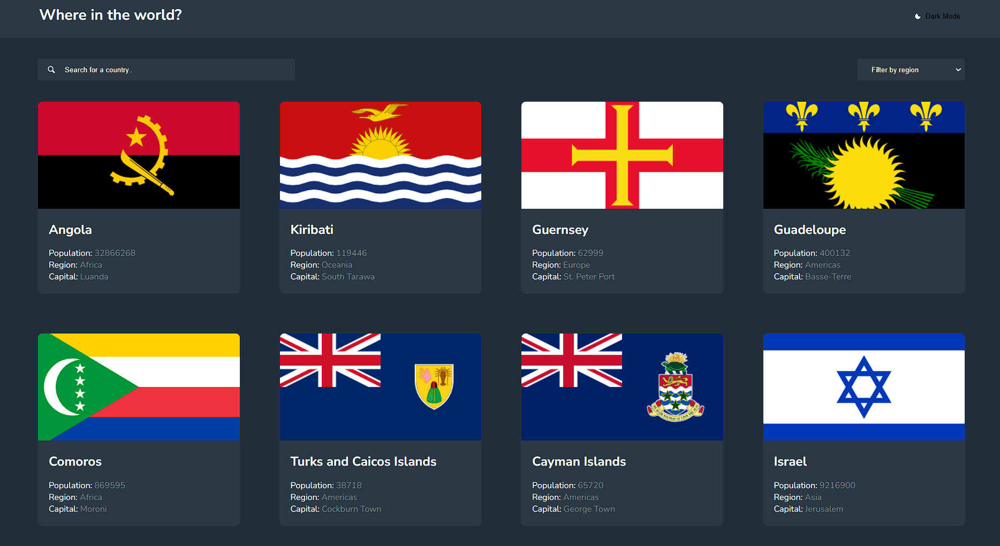
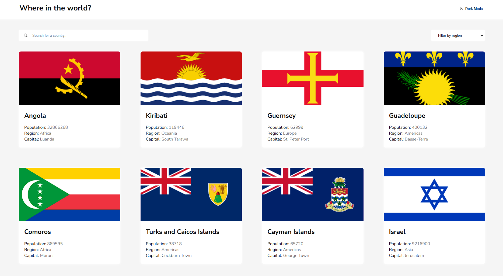
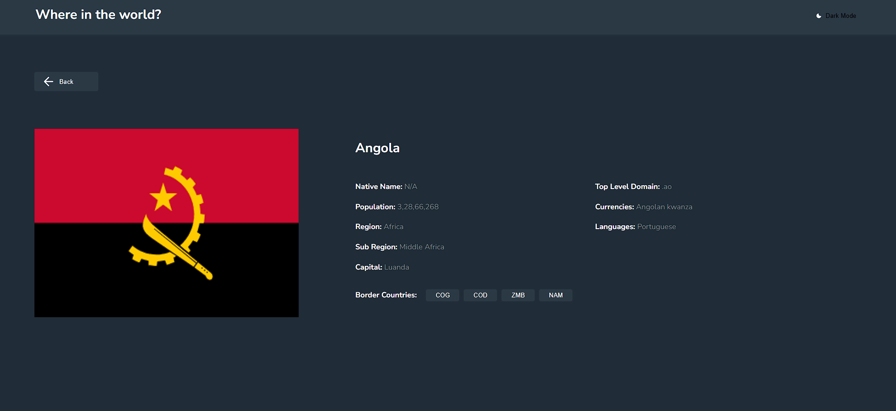
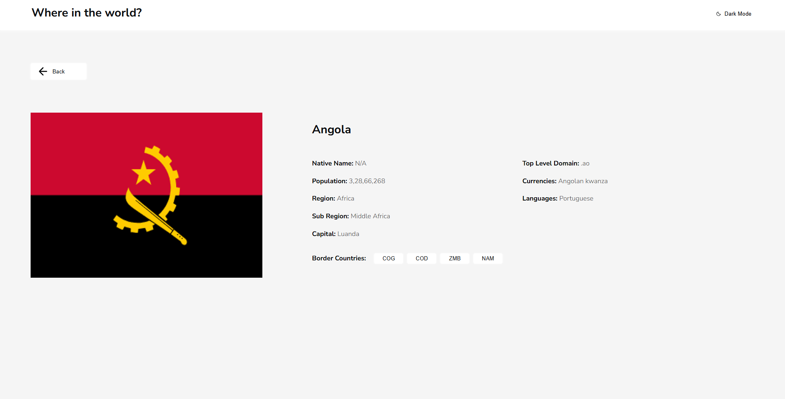
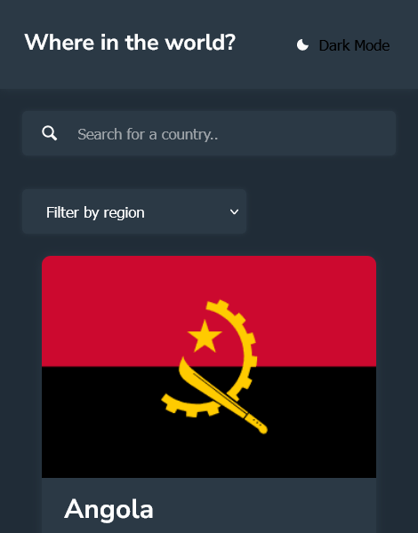
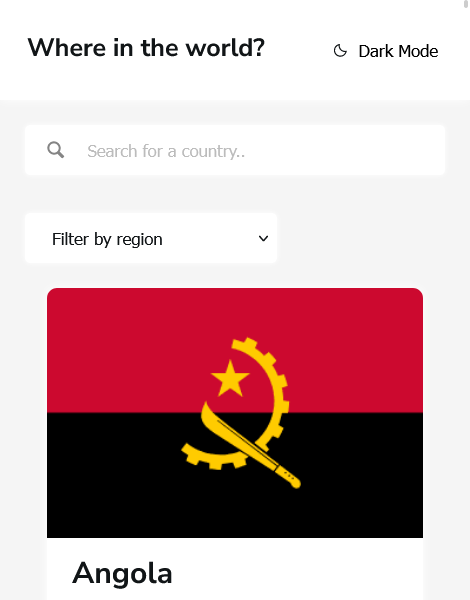
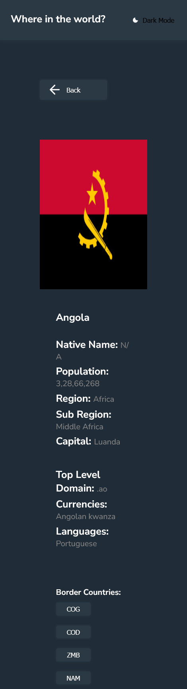
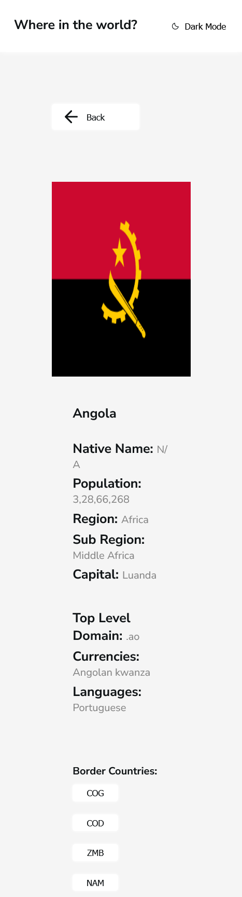

# Frontend Mentor - REST Countries API with color theme switcher solution

This is a solution to the [REST Countries API with color theme switcher challenge on Frontend Mentor](https://www.frontendmentor.io/challenges/rest-countries-api-with-color-theme-switcher-5cacc469fec04111f7b848ca). 

## Table of contents

- [Overview](#overview)
  - [The challenge](#the-challenge)
  - [Screenshot](#screenshot)
  - [Links](#links)
- [My process](#my-process)
  - [Built with](#built-with)
  - [What I learned](#what-i-learned)


## Overview

### The challenge

Users should be able to:

- See all countries from the API on the homepage
- Search for a country using an `input` field
- Filter countries by region
- Click on a country to see more detailed information on a separate page
- Toggle the color scheme between light and dark mode

### Screenshot










### Links

- Live Site URL: [Add live site URL here](https://country-details-app-green.vercel.app/)

## My process

### Built with

- Semantic HTML5 markup
- CSS custom properties
- Flexbox
- CSS Grid
- [React](https://reactjs.org/) - JS library
- [Icomoon App](https://icomoon.io/app/) - For icons

### What I learned

Dynamic filtering is a powerful technique that adds flexibility and interactivity to your projects. By allowing users to tailor their data views based on their preferences, you can enhance usability and provide a more personalized experience. Through my recent project, I learned the intricacies of filtering data efficiently, understanding how to parse user inputs and translate them into actionable filters. Incorporate these principles and best practices into your projects to master the art of data filtering and create more robust and user-centric applications.

This is my js code snippet for the same:

```js
const [filteredData, setFilteredData] = useState([])
useEffect(() => {
  fetch("https://restcountries.com/v3.1/all")
    .then(response => response.json())
    .then(data => {
        setData(data)
        setFilteredData(data)
    })
}, [])
function filterCountry(event){
  const search = event.target.value
  const filtered = data.filter((country) => country.name.common.toLowerCase().includes(search.toLowerCase()))

  setFilteredData(filtered)
}
```